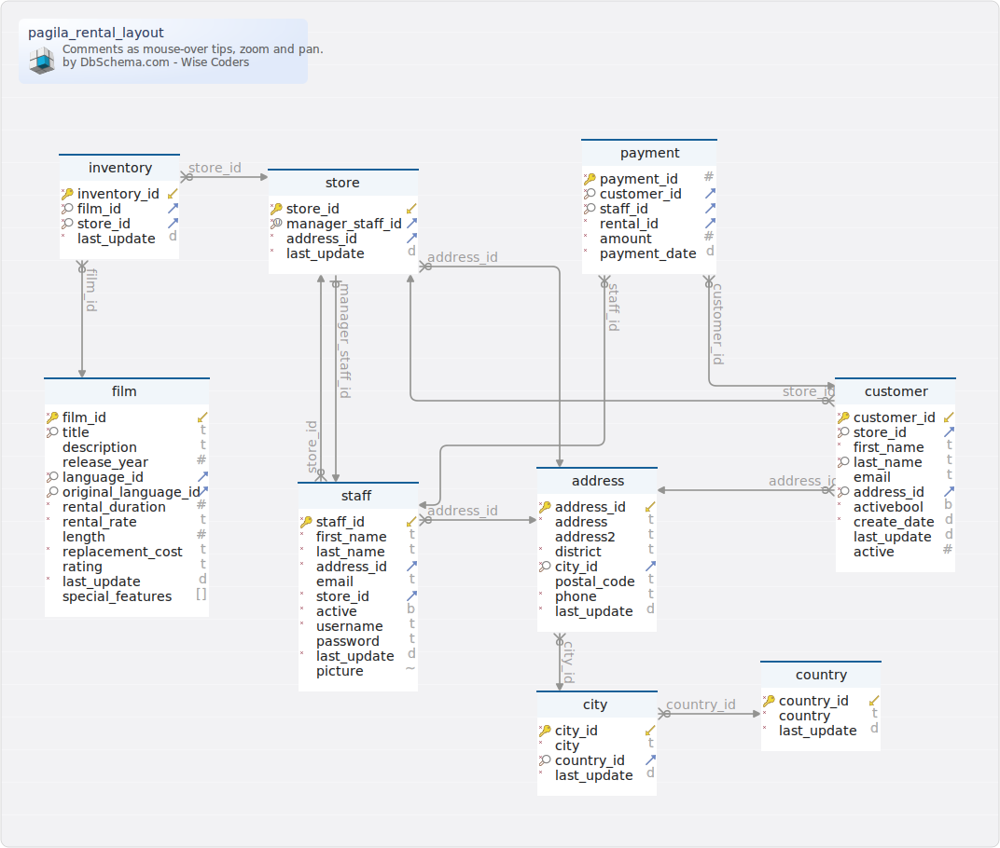

# Schéma `pagila` (vue partielle restreinte au tables touchant à la location)

Créé ` l'aide de  [DbSchema](https://dbschema.com)

`pagila` est un schéma d'entrainement dérivé du schéma `sakila`  de `MySQL`.  C'est une base de donnée fictive destinée à gérer le catalogue et les stocks d'une chaine de magasins de location de DVD (début du XXIème siècle). 

### Vue partielle restreinte au tables touchant à la location

Voir aussi [vue partielle restreinte au catalogue des films](./layout-pagila-film.html)

### Table pagila.address 
| | | |
|---|---|---|
| * &#128273;  &#11019; | address\_id| integer  DEFAULT nextval('pagila.address_address_id_seq'::regclass) |
| * | address| varchar(50)  |
|  | address2| varchar(50)  |
| * | district| varchar(20)  |
| * &#128270; &#11016; | city\_id| smallint  |
|  | postal\_code| varchar(10)  |
| * | phone| varchar(20)  |
| * | last\_update| timestamp  DEFAULT now() |

##### Foreign Keys
| | | |
|---|---|---|
|  | address_city_id_fkey | ( city\_id ) ref [pagila.city](#city) (city\_id) |

### Table pagila.city 
| | | |
|---|---|---|
| * &#128273;  &#11019; | city\_id| integer  DEFAULT nextval('pagila.city_city_id_seq'::regclass) |
| * | city| varchar(50)  |
| * &#128270; &#11016; | country\_id| smallint  |
| * | last\_update| timestamp  DEFAULT now() |

##### Foreign Keys
| | | |
|---|---|---|
|  | city_country_id_fkey | ( country\_id ) ref [pagila.country](#country) (country\_id) |

### Table pagila.country 
| | | |
|---|---|---|
| * &#128273;  &#11019; | country\_id| integer  DEFAULT nextval('pagila.country_country_id_seq'::regclass) |
| * | country| varchar(50)  |
| * | last\_update| timestamp  DEFAULT now() |

### Table pagila.customer 
| | | |
|---|---|---|
| * &#128273;  &#11019; | customer\_id| integer  DEFAULT nextval('pagila.customer_customer_id_seq'::regclass) |
| * &#128270; &#11016; | store\_id| smallint  |
| * | first\_name| varchar(45)  |
| * &#128270; | last\_name| varchar(45)  |
|  | email| varchar(50)  |
| * &#128270; &#11016; | address\_id| smallint  |
| * | activebool| boolean  DEFAULT true |
| * | create\_date| date  DEFAULT ('now'::text)::date |
|  | last\_update| timestamp  DEFAULT now() |
|  | active| integer  |

##### Foreign Keys
| | | |
|---|---|---|
|  | customer_store_id_fkey | ( store\_id ) ref [pagila.store](#store) (store\_id) |
|  | customer_address_id_fkey | ( address\_id ) ref [pagila.address](#address) (address\_id) |

### Table pagila.film 
| | | |
|---|---|---|
| * &#128273;  &#11019; | film\_id| integer  DEFAULT nextval('pagila.film_film_id_seq'::regclass) |
| * &#128270; | title| varchar(255)  |
|  | description| text  |
|  | release\_year| integer  |
| * &#128270; &#11016; | language\_id| smallint  |
| &#128270; &#11016; | original\_language\_id| smallint  |
| * | rental\_duration| smallint  DEFAULT 3 |
| * | rental\_rate| varchar(4)  DEFAULT 4.99 |
|  | length| smallint  |
| * | replacement\_cost| varchar(5)  DEFAULT 19.99 |
|  | rating| mpaa\_rating  DEFAULT 'G'::pagila.mpaa_rating |
| * | last\_update| timestamp  DEFAULT now() |
|  | special\_features| text[]  |

##### Foreign Keys
| | | |
|---|---|---|
|  | film_original_language_id_fkey | ( original\_language\_id ) ref [pagila.language](#language) (language\_id) |
|  | film_language_id_fkey | ( language\_id ) ref [pagila.language](#language) (language\_id) |

### Table pagila.inventory 
| | | |
|---|---|---|
| * &#128273;  &#11019; | inventory\_id| integer  DEFAULT nextval('pagila.inventory_inventory_id_seq'::regclass) |
| * &#128270; &#11016; | film\_id| smallint  |
| * &#128270; &#11016; | store\_id| smallint  |
| * | last\_update| timestamp  DEFAULT now() |

##### Foreign Keys
| | | |
|---|---|---|
|  | inventory_store_id_fkey | ( store\_id ) ref [pagila.store](#store) (store\_id) |
|  | inventory_film_id_fkey | ( film\_id ) ref [pagila.film](#film) (film\_id) |

### Table pagila.payment 
| | | |
|---|---|---|
| * &#128273;  | payment\_id| integer  DEFAULT nextval('pagila.payment_payment_id_seq'::regclass) |
| * &#128270; &#11016; | customer\_id| smallint  |
| * &#128270; &#11016; | staff\_id| smallint  |
| * &#11016; | rental\_id| integer  |
| * | amount| numeric(5,2)  |
| * | payment\_date| timestamp  |

##### Foreign Keys
| | | |
|---|---|---|
|  | payment_staff_id_fkey | ( staff\_id ) ref [pagila.staff](#staff) (staff\_id) |
|  | payment_rental_id_fkey | ( rental\_id ) ref [pagila.rental](#rental) (rental\_id) |
|  | payment_customer_id_fkey | ( customer\_id ) ref [pagila.customer](#customer) (customer\_id) |

### Table pagila.staff 
| | | |
|---|---|---|
| * &#128273;  &#11019; | staff\_id| integer  DEFAULT nextval('pagila.staff_staff_id_seq'::regclass) |
| * | first\_name| varchar(45)  |
| * | last\_name| varchar(45)  |
| * &#11016; | address\_id| smallint  |
|  | email| varchar(50)  |
| * &#11016; | store\_id| smallint  |
| * | active| boolean  DEFAULT true |
| * | username| varchar(16)  |
|  | password| varchar(40)  |
| * | last\_update| timestamp  DEFAULT now() |
|  | picture| bytea  |

##### Foreign Keys
| | | |
|---|---|---|
|  | staff_store_id_fkey | ( store\_id ) ref [pagila.store](#store) (store\_id) |
|  | staff_address_id_fkey | ( address\_id ) ref [pagila.address](#address) (address\_id) |

### Table pagila.store 
| | | |
|---|---|---|
| * &#128273;  &#11019; | store\_id| integer  DEFAULT nextval('pagila.store_store_id_seq'::regclass) |
| * &#128269; &#11016; | manager\_staff\_id| smallint  |
| * &#11016; | address\_id| smallint  |
| * | last\_update| timestamp  DEFAULT now() |

##### Foreign Keys
| | | |
|---|---|---|
|  | store_manager_staff_id_fkey | ( manager\_staff\_id ) ref [pagila.staff](#staff) (staff\_id) |
|  | store_address_id_fkey | ( address\_id ) ref [pagila.address](#address) (address\_id) |

