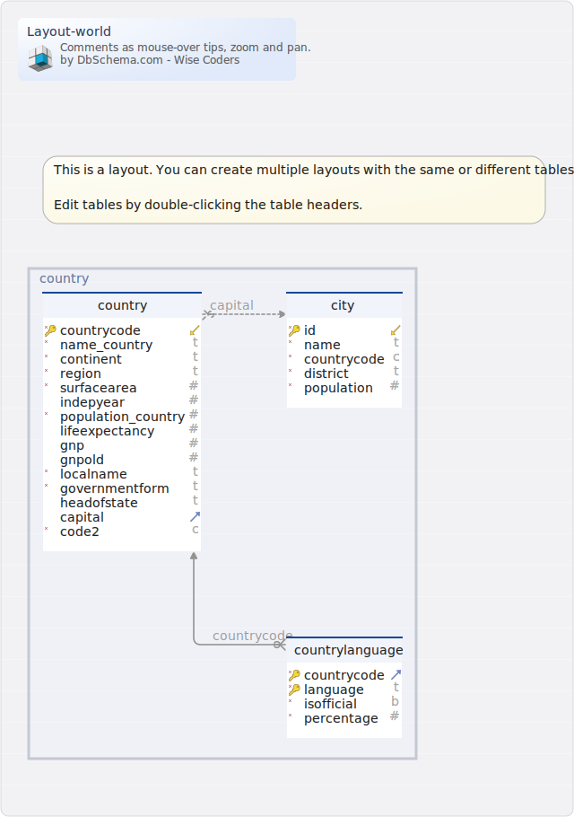

# Schéma world

Créé par [DbSchema](https://dbschema.com)

### Vue d'ensemble

### Table world.city 
| | | |
|---|---|---|
| * &#128273;  &#11019; | id| integer  |
| * | name| text  |
| * | countrycode| char(3)  |
| * | district| text  |
| * | population| integer  |

### Table world.country 
| | | |
|---|---|---|
| * &#128273;  &#11019; | countrycode| char(3)  |
| * | name\_country| text  |
| * | continent| text  |
| * | region| text  |
| * | surfacearea| real  |
|  | indepyear| smallint  |
| * | population\_country| integer  |
|  | lifeexpectancy| real  |
|  | gnp| numeric(10,2)  |
|  | gnpold| numeric(10,2)  |
| * | localname| text  |
| * | governmentform| text  |
|  | headofstate| text  |
| &#11016; | capital| integer  |
| * | code2| char(2)  |

##### Foreign Keys
| | | |
|---|---|---|
|  | country_capital_fkey | ( capital ) ref [world.city](#city) (id) |

##### Constraints
| | |
|---|---|
| country_continent_check | ((continent = 'Asia'::text) OR (continent = 'Europe'::text) OR (continent = 'North America'::text) OR (continent = 'Africa'::text) OR (continent = 'Oceania'::text) OR (continent = 'Antarctica'::text) OR (continent = 'South America'::text)) |

### Table world.countrylanguage 
| | | |
|---|---|---|
| * &#128273;  &#11016; | countrycode| char(3)  |
| * &#128273;  | language| text  |
| * | isofficial| boolean  |
| * | percentage| real  |

##### Foreign Keys
| | | |
|---|---|---|
|  | countrylanguage_countrycode_fkey | ( countrycode ) ref [world.country](#country) (countrycode) |

