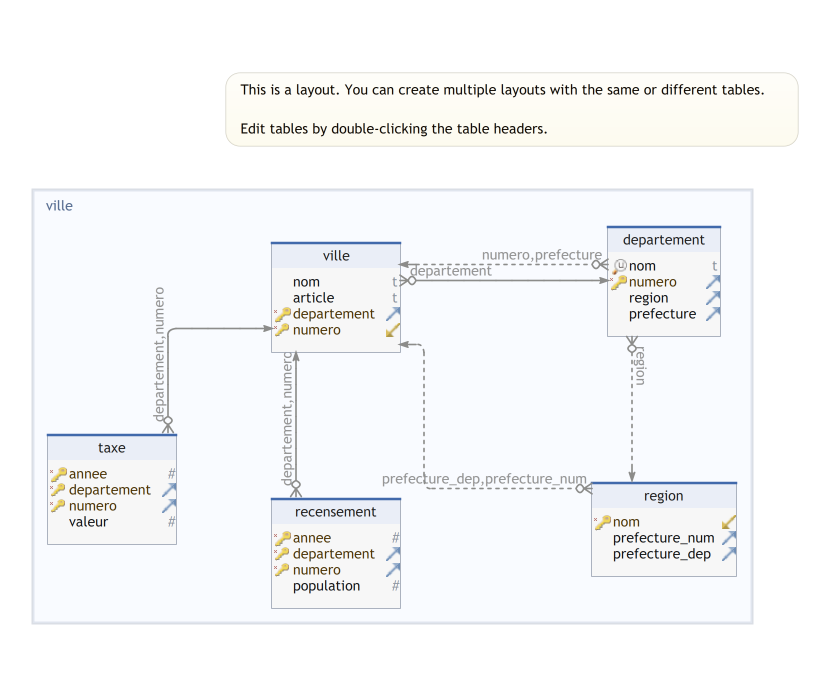

### Schema relationnel pattes de corbeau

### Table villes.departement 
| | | |
|---|---|---|
| &#128269; | nom| varchar  |
| * &#128273;  &#11016; | numero| integer  |
| &#11016; | region| varchar  |
| &#11016; | prefecture| integer  |

##### Foreign Keys
| | | |
|---|---|---|
|  | departement_fk | ( region ) ref [villes.region](#region) (nom) |
|  | departement_prefecture_fk | ( numero, prefecture ) ref [villes.ville](#ville) (departement, numero) |

### Table villes.recensement 

| | | |
|---|---|---|
| * &#128273;  | annee| integer  |
| * &#128273;  &#11016; | departement| integer  |
| * &#128273;  &#11016; | numero| integer  |
|  | population| integer  |

##### Foreign Keys
| | | |
|---|---|---|
|  | recensement_fk | ( departement, numero ) ref [villes.ville](#ville) (departement, numero) |

### Table villes.region 
| | | |
|---|---|---|
| * &#128273;  &#11019; | nom| varchar  |
| &#11016; | prefecture\_num| integer  |
| &#11016; | prefecture\_dep| integer  |

##### Foreign Keys
| | | |
|---|---|---|
|  | region_prefecture_fk | ( prefecture\_dep, prefecture\_num ) ref [villes.ville](#ville) (departement, numero) |

### Table villes.taxe 
| | | |
|---|---|---|
| * &#128273;  | annee| integer  |
| * &#128273;  &#11016; | departement| integer  |
| * &#128273;  &#11016; | numero| integer  |
|  | valeur| integer  |

##### Foreign Keys
| | | |
|---|---|---|
|  | taxe_fk | ( departement, numero ) ref [villes.ville](#ville) (departement, numero) |

### Table villes.ville 
| | | |
|---|---|---|
|  | nom| varchar  |
|  | article| varchar  |
| * &#128273;  &#11016; | departement| integer  |
| * &#128273;  &#11019; | numero| integer  |

##### Foreign Keys
| | | |
|---|---|---|
|  | ville_fk | ( departement ) ref [villes.departement](#departement) (numero) |

